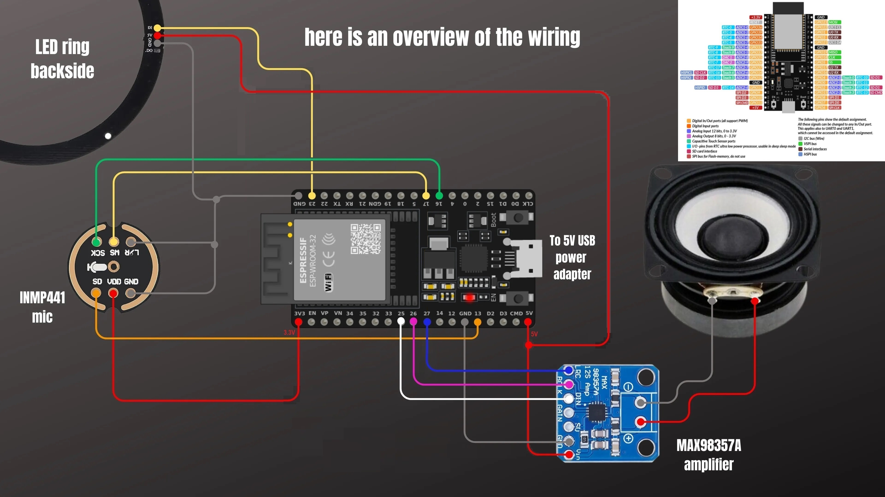

# HA ESP32 Voice Assistant

> A fully local, privacy-friendly voice assistant for **Home Assistant** built with an ESP32 microcontroller, I²S microphone, I²S audio amplifier, and a WS2812 LED ring — powered by **ESPHome**.

[](https://esphome.io/)
[](https://www.home-assistant.io/)
[](https://esphome.io)
[](https://www.espressif.com/)
[](https://docs.espressif.com/projects/esp-idf/)

---
## Wire Diagram


 
---
 
## Table of Contents
 
- [Overview](#overview)
- [Features](#features)
- [Hardware Requirements](#hardware-requirements)
- [Wiring Diagram](#wiring-diagram)
- [Pin Mapping](#pin-mapping)
- [Software Requirements](#software-requirements)
- [Installation & Setup](#installation--setup)
  - [1. Home Assistant Preparation](#1-home-assistant-preparation)
  - [2. ESPHome Configuration](#2-esphome-configuration)
  - [3. Flashing the ESP32](#3-flashing-the-esp32)
  - [4. Adding the Device to Home Assistant](#4-adding-the-device-to-home-assistant)
- [ESPHome YAML Overview](#esphome-yaml-overview)
- [LED Status Indicators](#led-status-indicators)
- [Voice Pipeline Setup](#voice-pipeline-setup)
- [Troubleshooting](#troubleshooting)
- [Known Limitations](#known-limitations)
- [Contributing](#contributing)
- [License](#license)
 
---
 
## Overview
 
This project turns a low-cost ESP32 development board into a **voice satellite** for Home Assistant's built-in [Assist](https://www.home-assistant.io/voice_control/) pipeline. By combining the INMP441 digital MEMS microphone, the MAX98357 I²S audio amplifier, and a WS2812 LED ring, you get a compact, always-on voice assistant that:
 
- Listens for a **wake word** locally on-device (no cloud required)
- Streams audio to Home Assistant for **speech-to-text** processing
- Plays back the **text-to-speech** response through the onboard speaker
- Gives visual feedback via the **LED ring** at every step of the conversation
 
All firmware is defined in a single ESPHome YAML file and flashed directly to the ESP32 over USB or OTA.
 
---
 
## Features
 
| Feature | Details |
|---|---|
| Wake word detection | On-device micro wake word (e.g. *Okay Nabu*, *Hey Jarvis*) |
| Microphone | INMP441 — digital I²S MEMS, 24-bit, omnidirectional |
| Speaker output | MAX98357A — class D I²S amplifier, up to 3 W @ 4 Ω |
| Visual feedback | WS2812 RGB LED ring with per-state animations |
| Integration | Native ESPHome ↔ Home Assistant API (encrypted) |
| OTA updates | Wireless firmware updates via ESPHome dashboard |
| Noise suppression | Configurable on-device noise suppression (level 0–4) |
| Auto gain | Configurable auto-gain (0–31 dBFS) |
| Volume multiplier | Software volume boost for the voice pipeline |
| Fallback hotspot | Captive portal Wi-Fi fallback if network is unavailable |
 
---
 
## Hardware Requirements
 
| Component | Description | Approx. Cost |
|---|---|---|
| **ESP32 Dev Board** | ESP32 WROOM-32 / DevKit v1 (or ESP32-S3 for wake word) | ~€4–8 |
| **INMP441** | I²S MEMS microphone breakout module | ~€2–4 |
| **MAX98357A** | I²S Class D audio amplifier breakout (Adafruit or clone) | ~€3–6 |
| **WS2812B LED Ring** | Addressable RGB LED ring (8–16 LEDs recommended) | ~€3–6 |
| **Speaker** | 3 W, 4 Ω or 8 Ω small speaker | ~€2–5 |
| **Jumper wires** | Male-to-male / male-to-female dupont cables | ~€1–2 |
| **Breadboard / PCB** | For prototyping or permanent build | ~€1–3 |
| **5 V USB power supply** | ≥ 1 A recommended | — |
 
> **Note on wake word:** On-device micro wake word (`micro_wake_word`) requires an **ESP32-S3** with PSRAM (e.g. the N8R2 or N16R8 variant). A standard ESP32 WROOM-32 can use wake word detection via Home Assistant's Assist pipeline (server-side), but not locally on-device.
 
---
 
## Wiring Diagram
 
The repository includes a visual wiring diagram at the root level:
 
```
ESP32_VA_Wire-Diagram.jpg
```
 
Refer to this image for the exact physical connections between the ESP32, INMP441, MAX98357A, and the WS2812 LED ring.
 
---
 
## Pin Mapping
 
The table below shows the default GPIO assignments used in the ESPHome configuration. Adjust them in the YAML if your board layout differs.
 
### INMP441 (I²S Microphone)
 
| INMP441 Pin | ESP32 GPIO | Description |
|---|---|---|
| VDD | 3.3 V | Power supply |
| GND | GND | Ground |
| SD | GPIO 23 | Serial Data (I²S DIN) |
| WS | GPIO 25 | Word Select / LRCLK |
| SCK | GPIO 26 | Serial Clock / BCLK |
| L/R | GND | Channel select — tie to GND for left channel |
 
### MAX98357A (I²S Amplifier)
 
| MAX98357A Pin | ESP32 GPIO | Description |
|---|---|---|
| VIN | 5 V | Power supply (use 5 V for less noise) |
| GND | GND | Ground |
| DIN | GPIO 22 | Serial Data (I²S DOUT) |
| BCLK | GPIO 26 | Bit Clock (shared with mic if same I²S bus) |
| LRC | GPIO 25 | Left/Right Clock (shared with mic if same I²S bus) |
| SD (shutdown) | — | Leave floating or tie to 3.3 V to enable |
| GAIN | — | Leave floating for 9 dB gain (default) |
 
> **Tip:** If your build suffers from speaker hiss or crosstalk, power the MAX98357A from the **5 V** rail rather than 3.3 V, and route the microphone and amplifier on **separate I²S bus IDs** in ESPHome (requires two sets of BCLK/LRCLK pins — this is straightforward on ESP32-S3 which has two hardware I²S peripherals).
 
### WS2812 LED Ring
 
| LED Ring Pin | ESP32 GPIO | Description |
|---|---|---|
| VCC | 5 V | Power supply |
| GND | GND | Ground |
| DIN | GPIO 27 | Data input — **DIN, not DOUT** |
 
---
 
## Software Requirements
 
- **Home Assistant** (any recent release with Assist pipeline support)
- **ESPHome add-on** installed inside Home Assistant  
  *(Settings → Add-ons → Add-on Store → ESPHome Device Builder)*
- **A configured Voice Pipeline** in Home Assistant  
  *(Settings → Voice Assistants → Add Assistant)*
  - STT (Speech-to-Text): e.g. Whisper (local) or cloud-based
  - TTS (Text-to-Speech): e.g. Piper (local) or cloud-based
  - Conversation agent: e.g. Home Assistant built-in, OpenAI, or a local LLM
 
---
 
## Installation & Setup
 
### 1. Home Assistant Preparation
 
1. Make sure the **ESPHome add-on** is installed and running.
2. Set up at least one **Voice Pipeline** under *Settings → Voice Assistants*.
3. Optionally install a **local STT** (e.g. the *Whisper* add-on) and **local TTS** (e.g. the *Piper* add-on) for a fully offline experience.
 
### 2. ESPHome Configuration
 
1. Open the **ESPHome dashboard** in Home Assistant.
2. Click **+ New Device** and follow the wizard (choose ESP32 as the platform).
3. Once the device is created, click **Edit** and **replace** the generated YAML with the file from this repository:
 
```
ESPHome/<your-config-file>.yaml
```
 
4. Update the following sections to match your setup:
 
```yaml
substitutions:
  device_name: "esp32-voice-assistant"
  # Adjust wake word: okay_nabu | hey_jarvis | alexa
  micro_wake_word_model: okay_nabu
 
wifi:
  ssid: !secret wifi_ssid
  password: !secret wifi_password
 
api:
  encryption:
    key: !secret api_key
 
ota:
  password: !secret ota_password
```
 
5. Make sure your `secrets.yaml` contains all referenced secrets:
 
```yaml
wifi_ssid: "YourWiFiName"
wifi_password: "YourWiFiPassword"
api_key: "your-32-byte-base64-api-key"
ota_password: "your-ota-password"
```
 
### 3. Flashing the ESP32
 
**First-time flash (USB):**
 
1. Connect the ESP32 to your computer or Home Assistant host via USB.
2. In the ESPHome dashboard, click **Install → Plug into this computer** (or *Plug into the computer running ESPHome*).
3. Select the correct serial port and wait for compilation and flashing to complete.
 
**Subsequent updates (OTA):**
 
After the first flash, all future updates can be done wirelessly:
 
1. In the ESPHome dashboard, click **Install → Wirelessly**.
2. ESPHome will compile and push the firmware to the device over Wi-Fi.
 
### 4. Adding the Device to Home Assistant
 
1. Once the ESP32 boots and connects to Wi-Fi, Home Assistant will automatically discover it.
2. Go to **Settings → Devices & Services → ESPHome** and click **Configure**.
3. Enter the API encryption key when prompted.
4. The device will appear as a new ESPHome device with a **Voice Assistant** entity.
5. In **Settings → Voice Assistants**, assign the device to your preferred Voice Pipeline.
 
---
 
## ESPHome YAML Overview
 
The ESPHome configuration (`ESPHome/*.yaml`) is organized into the following sections:
 
| Section | Purpose |
|---|---|
| `substitutions` | Central place to change device name, wake word model, pin numbers |
| `esp32` / `esp32s3` | Board definition, framework (esp-idf), flash size, PSRAM mode |
| `wifi` | Wi-Fi credentials, fallback AP / captive portal |
| `api` | Encrypted Home Assistant API connection |
| `ota` | Over-the-air firmware update password |
| `i2s_audio` | I²S bus definition (BCLK + LRCLK pins) |
| `microphone` | INMP441 — I²S input, channel, bit depth, PDM disabled |
| `speaker` | MAX98357A — I²S output, mono, DAC type external |
| `micro_wake_word` | On-device wake word model (ESP32-S3 only) |
| `voice_assistant` | Ties microphone + speaker + wake word together, noise/gain settings |
| `light` | WS2812 LED ring — NeoPixel, addressable, RGB |
| `script` | `control_leds` — central LED animation logic driven by VA state |
| `on_boot` | Initialization sequence — waits for API, then starts wake word loop |
 
### Key `voice_assistant` Parameters
 
```yaml
voice_assistant:
  microphone: inmp441_mic
  speaker: max98357_speaker
  micro_wake_word: wake_word_engine
  noise_suppression_level: 2   # 0 (off) to 4 (max)
  auto_gain: 31dBFS             # 0dBFS to 31dBFS
  volume_multiplier: 4.0        # Software boost for quiet microphones
```
 
---
 
## LED Status Indicators
 
The WS2812 LED ring provides real-time visual feedback about the assistant's state:
 
| State | LED Behaviour | Color |
|---|---|---|
| Idle / Waiting for wake word | Slow breathing pulse | Blue |
| Wake word detected | All LEDs on, solid | Cyan |
| Listening for command | Spinning / chasing animation | Green |
| Processing (thinking) | Fast pulsing | Yellow |
| Replying (TTS playback) | Solid | Purple / White |
| Error | Short flash | Red |
| Not connected to HA | Slow pulse | Orange |
 
*Exact colors and animations may vary based on your YAML configuration. Customize the `control_leds` script to your preference.*
 
---
 
## Voice Pipeline Setup
 
For the best experience, set up a **local** Voice Pipeline in Home Assistant:
 
1. **STT — Whisper (local):**
   - Install the *Whisper* add-on from the Home Assistant add-on store.
   - Select a model size appropriate for your hardware (e.g. `tiny` or `base` for Raspberry Pi 4).
 
2. **TTS — Piper (local):**
   - Install the *Piper* add-on.
   - Choose a language model (e.g. `en_US-lessac-medium` for English).
 
3. **Conversation Agent:**
   - Use Home Assistant's built-in intent recognition for smart home commands.
   - Optionally connect a local LLM (e.g. via the *Ollama* or *LocalAI* integration) for open-ended conversation.
 
4. **Assign the Pipeline:**
   - Go to *Settings → Voice Assistants*.
   - Create or edit an assistant and assign the above STT/TTS/Agent.
   - In the ESPHome device settings, select this pipeline.
 
---
 
## Troubleshooting
 
**Device does not connect to Home Assistant**
- Verify that the `api:` section in the YAML contains an `encryption: key:` entry.
- Confirm the encryption key in `secrets.yaml` matches what was entered in HA during device setup.
- Check that the ESP32 and Home Assistant are on the same network / VLAN.
 
**No audio output / speaker silent**
- Double-check the DIN, BCLK, and LRC pin connections on the MAX98357A.
- Try powering the MAX98357A from 5 V instead of 3.3 V.
- Make sure `dac_type: external` is set in the ESPHome speaker section.
 
**Microphone not picking up audio / crackling**
- Ensure the INMP441's L/R pin is tied to GND (selects left channel).
- Set `channel: left` and `bits_per_sample: 32bit` in the microphone config.
- If you hear crackling: try increasing `noise_suppression_level` or routing mic and amp on separate I²S buses.
 
**Wake word not detected**
- On-device micro wake word requires an **ESP32-S3 with PSRAM**. A standard WROOM-32 does not have enough RAM.
- Ensure `psram: mode: octal` (or `quad` for N8R2) is set in the YAML.
- Speak clearly, at normal distance (30–50 cm), and avoid background noise.
 
**LEDs not lighting up**
- Confirm data is connected to **DIN** (input), not DOUT (output) of the LED ring.
- Make sure the LED ring is powered from 5 V, not 3.3 V.
- Verify the correct GPIO pin is set under `pin:` in the `light:` section.
 
**OTA update fails**
- Make sure the ESP32 and the ESPHome dashboard host are on the same network.
- Check that the `ota: password:` in YAML matches `secrets.yaml`.
- If the device becomes unreachable, re-flash via USB.
 
---
 
## Known Limitations
 
- **Echo cancellation** is not supported on ESP32/ESP32-S3 without a dedicated DSP chip (e.g. XMOS). If the speaker is loud, the microphone may pick up TTS audio and misfire wake word detection. Mitigation: use a directional speaker placement or lower speaker volume.
- **Simultaneous music playback + voice assistant** requires an ESP32-S3 and the Nabu Casa media player component, which is not part of this basic configuration.
- **Bluetooth** is disabled by default in the YAML to save RAM for wake word detection.
 
---
 
## Contributing
 
Contributions, improvements, and bug reports are welcome! Please:
 
1. Fork the repository.
2. Create a feature branch: `git checkout -b feature/my-improvement`
3. Commit your changes with a clear message.
4. Open a Pull Request and describe what you changed and why.
 
If you encounter issues, please open a GitHub Issue with:
- Your ESPHome version
- Your ESP32 board model (WROOM-32, S3-DevKitC, etc.)
- The relevant portion of your YAML configuration
- Serial logs or ESPHome compile output
 
---
 
## License
 
This project is released under the terms of the license included in the [LICENSE](LICENSE) file.
 
---
 
*Built with ❤️ using [ESPHome](https://esphome.io) and [Home Assistant](https://www.home-assistant.io).*
